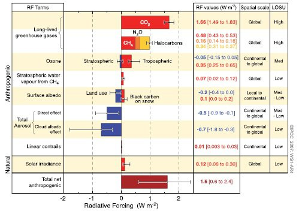
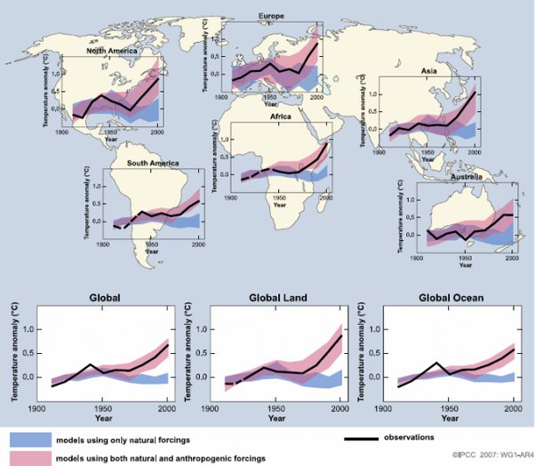

*Réponse publiée [sur Quora](https://fr.quora.com/Les-analyses-du-GIEC-sont-elles-biais%C3%A9es-du-fait-quelles-ne-consid%C3%A8rent-que-laspect-humain-dans-les-causes-du-r%C3%A9chauffement-climatique/answer/Dr-Goulu)*

Non.

Le [Groupe d'experts intergouvernemental sur l'évolution du climat](w:)à été fondé en 1988 sous la pression de Reagan et Thatcher, écologistes bien connus, pour superviser des travaux de l'Organisation Météorologique Mondiale qui disait que la Terre se réchauffe.

Il faut insister sur le fait que le GIEC ne fait pas d'analyses, il fait des synthèses de milliers de travaux de recherche menés dans le monde entier par les scientifiques de très nombreux organismes différents*.

Les premiers travaux du GIEC dans les années 1990 ont été de confirmer les mesures, donc d'établir le fait (contesté à l'époque) : la Terre se réchauffe.

Les travaux suivants ont d'en établir l'origine. Le [rapport du GIEC de 2007 contient cette figure](https://archive.ipcc.ch/publications_and_data/ar4/wg1/fr/spmsspm-2.html)qui montre l'impact des causes naturelles et d'origine humaine :

On remarque:

1. que les activités humaines ont aussi des effets de refroidissement (en bleu)
2. que seule la variation du rayonnement solaire se retrouve dans les causes naturelles car elle a une contribution significative. De plus, comme indiqué dans le texte : "*Les aérosols volcaniques sont un facteur supplémentaire du forçage naturel, mais ne sont pas inclus dans cette figure en raison de leur nature sporadique."
(*mais les aérosols volcaniques, composés notamment de soufre, causent plutôt un refroidissement, et comme évoqué dans une autre réponse, la production volcanique de CO2 est négligeable par rapport aux émissions humaines)

Le même rapport contient aussi cette figure, dans laquelle on voit des simulations du climat au 20ème siècle faites :

- en bleu en ne tenant compte que des facteurs naturels
- en rouge en tenant compte des activités humaines
- avec en noir les mesures réelles :

On voit qu'on pouvait encore discutailler de la responsabilité humaine jusque vers 1970, voire 1990 en certaines régions, mais que depuis les choses sont très claires : le réchauffement est du à l'activité humaine.

Donc depuis 2007, le GIEC fait des prévisions du climat futur en se basant sur divers scenarios de l'activité humaine, simplement parce qu'il n'a plus rien d'autre à faire.

Note * : regardez par exemple un chapitre d'un rapport du GIEC pris au hasard :

[https://archive.ipcc.ch/pdf/asse...](https://archive.ipcc.ch/pdf/assessment-report/ar5/wg1/WG1AR5_Chapter02_FINAL.pdf)

sur 96 pages, les 17 dernières sont la liste des 850 (!) références utilisées pour écrire le chapitre …
