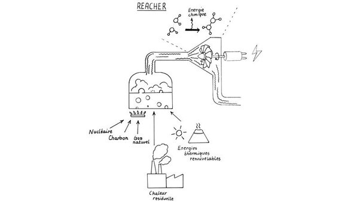

*Réponse publiée [sur Quora](https://fr.quora.com/Peut-on-croire-que-le-projet-REACHER-de-la-scientifique-lorraine-Sylvia-Lasala-va-r%C3%A9ellement-d%C3%A9boucher-sur-un-nouveau-mode-de-production-%C3%A9nerg%C3%A9tique/answer/Dr-Goulu)*

D'après ce que je vois ici [[1]](#AoSBa) , ce n'est pas ça. Elle le dit elle-même :

> *Le projet REACHER permettra de découvrir pour la première fois le potentiel de l'exploitation de l'énergie chimique dans des cycles thermodynamiques*

Son idée est d'utiliser la chaleur résiduelle des fluides caloporteurs - utilisés pour transporter la chaleur d'une source thermique classique (nucléaire, charbon, gaz…) ou renouvelables (solaire thermique, géothermie) vers une turbine produisant de l'électricité - pour produire aussi des transformations chimiques

C'est illustré par ce dessin :

Il s'agit d'augmenter leur rendement global, et de rendre rentables de petites installations.

Bonne idée ! Si on peut utiliser même juste un petit peu la chaleur résiduelle d'une centrale thermique, c'est bon à prendre.

Après, avec 1.5 millions on ne va pas loin dans ce domaine. Ca va juste financer quelques chercheurs quelques années, et en cas de succès la route sera encore très longue…

Un cas similaire :

[https://www.drgoulu.com/2009/09/...](https://www.drgoulu.com/2009/09/15/de-graetzel-aux-great-cells/)

Notes de bas de page

[[1]](#cite-AoSBa)[Nancy : une scientifique décroche une bourse de 1,5 million d'euros, son travail pourrait révolutionner la production d'énergie](https://france3-regions.francetvinfo.fr/grand-est/meurthe-et-moselle/nancy/nancy-une-scientifique-de-l-universite-de-lorraine-decroche-une-bourse-de-1-5-m-son-travail-pourrait-revolutionner-la-production-d-energie-2438320.html)
