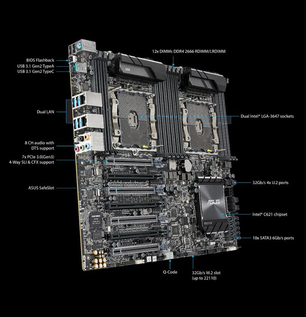
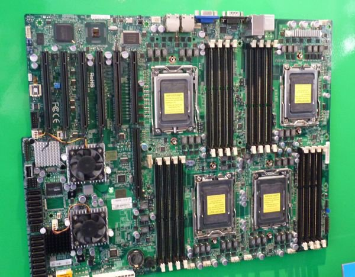

*Réponse publiée [sur Quora](https://fr.quora.com/Pourquoi-nest-il-pas-possible-dajouter-deux-processeurs-dans-un-PC-comme-la-RAM/answer/Dr-Goulu)*

On peut. Ca se fait surtout pour les serveurs :

Il y a même des cartes à 4 processeurs

(je vous laisse chercher les marques et modèles, veux pas faire de pub…)

Si vous regardez les cartes (et les prix…) ça revient plutôt à juxtaposer 2 ou 4 processeurs + mémoire.

Les processeurs communiquent entre eux par des bus spéciaux comme [HyperTransport](w:), qui sont rapides, mais pas autant qu'entre un processeur et sa mémoire. vous n'obtenez donc 2 ou 4 fois les performances que s'ils communiquent peu entre eux, comme c'est le cas dans les serveurs.
