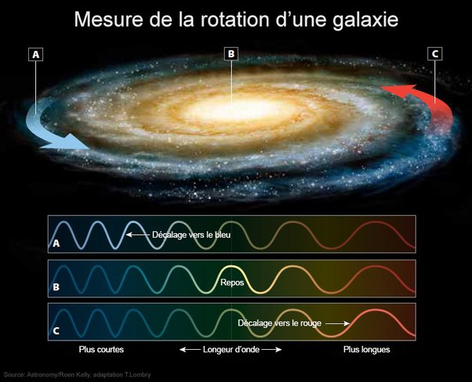

*Réponse publiée [sur Quora](https://fr.quora.com/Si-une-galaxie-est-un-champ-gravitationnel-contenant-des-%C3%A9toiles-dont-la-propre-vitesse-les-maintient-en-orbite-quest-ce-qui-pourrait-indiquer-que-ce-champ-gravitationnel-est-en-rotation/answer/Dr-Goulu)*

Il me semble que vous mélangez deux choses:

- on peut mesurer la rotation des galaxies en comparant le spectre des étoiles situées d'un côté et de l'autre du centre galactique

( source : Astrosurf : [La cinématique des galaxies](http://www.astrosurf.com/luxorion/univers-cinematique-galaxies.htm) )

on arrive même à mesurer ainsi la fameuse [Courbe de rotation des galaxies](w:) qui a amené la notion de "matière noire"

- le "champ gravitationnel" déformé par ces masses s' "enroule" en effet sous l'effet de la rotation . Cet effet relativiste s'appelle l'[Effet Lense-Thirring](w:), et il a été mesuré autour de la Terre par [Gravity Probe B](w:)et observé avec une naine blanche orbitant autour du pulsar [PSR J1141−6545](w:en:PSR_J1141−6545).
A ma connaissance il n'y pas été mesuré autour d'une galaxie, parce qu'on ne sait pas comment faire, mais il n'y a aucun doute (= jusqu'à preuve du contraire) qu'il existe.
