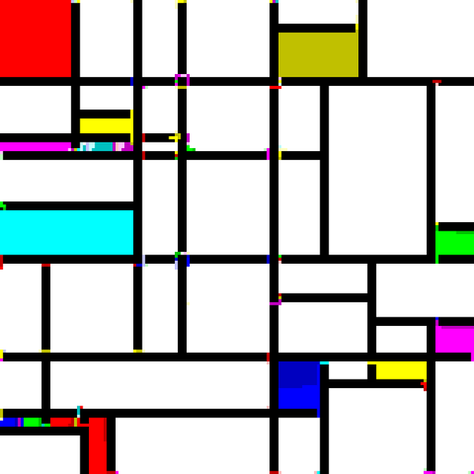

*Réponse publiée [sur Quora](https://fr.quora.com/Que-disent-les-math%C3%A9maticiens-des-tableaux-de-Mondrian-Y-trouve-t-on-des-propri%C3%A9t%C3%A9s-int%C3%A9ressantes/answer/Dr-Goulu)*

Les informaticiens ont renversé l'approche avec le langage de programmation [Piet](w:)(prénom de Mondrian). Dans ce langage, les instructions sont codées par les changements de couleur de blocs parcourus dans un certain ordre, et les programmes ressemblent donc à des œuvres de Mondrian.

Voici par exemple un programme qui teste si un nombre est premier ou pas:

(autres exemples : [DM's Esoteric Programming Languages](https://www.dangermouse.net/esoteric/piet/samples.html) )
