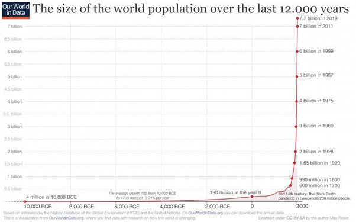

*Réponse publiée [sur Quora](https://fr.quora.com/Quels-sont-les-risques-de-lutilisation-excessive-des-engrais-chimiques-et-des-pesticides-pour-lenvironnement-et-lhomme/answer/Dr-Goulu)*

les risques sont qu'on arrive à nourrir 8 milliards d'êtres humains, dont vous, après avoir fait quasiment disparaître les famines dues aux maladies et aux ravageurs.

Ces 8 milliards d'humains ont ensuite un impact général sur l’environnement que certains qualifient de négatif.

Quand on était moins d'un milliard, 2/3 des enfants mouraient en bas âge, les autres avaient une espérance de vie de l'ordre de 50 ans, mais on ne faisait pas tout un plat avec des molécules "potentiellement cancérogènes" …

