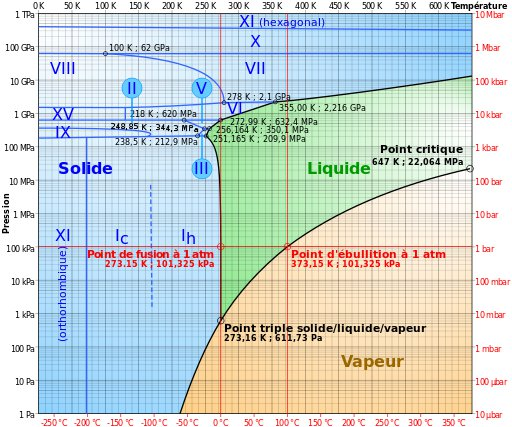
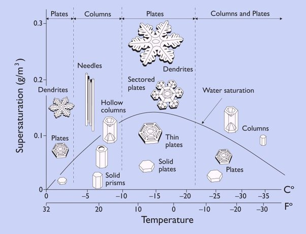

*Réponse publiée [sur Quora](https://fr.quora.com/Peut-on-rendre-leau-solide-sans-la-geler/answer/Dr-Goulu)*

Pour répondre à cette question, il faut examiner le [Diagramme de phase](w:) de l'eau :

où on voit que :

1. c'est vachement plus compliqué que ce qu'on apprend à l'école primaire, notamment en raison des multiples formes de glace
2. oui, à température ambiante, si on augmente la pression jusque vers 1.1 GPa (=11'000 atmosphères…) l'eau se solidifie en [Glace VI](w:)

[https://www.drgoulu.com/2012/11/...](https://www.drgoulu.com/2012/11/05/glace-9/)

et oui [Lajos](https://fr.quora.com/profile/Lajos-10) vous avez raison : en refroidissant de l'eau extrêmement vite vous obtenez de la [Glace amorphe](w:), non représentée sur le diagramme. On en connaît même 3 types en fonction des conditions de pression et de température. Mais ça n'arrive pas dans la nature.

La forme des glaçons/flocons qui se forment dans l'air dépend "juste" des conditions de température et d'humidité de l'air selon ce diagramme :

[https://www.drgoulu.com/2007/01/...](https://www.drgoulu.com/2007/01/23/il-neige-de-beaux-flocons/)
