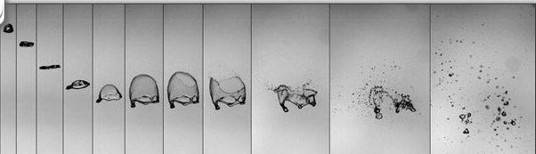

*Réponse publiée [sur Quora](https://fr.quora.com/De-quoi-d%C3%A9pend-la-forme-dune-goutte-de-pluie-Quest-ce-qui-influence-exactement-la-forme-des-gouttes-de-pluie/answer/Dr-Goulu)*

la [Tension superficielle](w:) tend à former des gouttes sphériques, mais le frottement de l’air lors de la chute les déforme, mais pas en forme de goutte.

La [Forme d'une goutte de pluie](w:) dépend de sa taille. Les petites sont à peu près sphériques. Vers 3–4 mm, elles s’aplatissent en bas et vers 5 mm elles deviennent des disques, puis se creusent comme des parachutes et éclatent en petites gouttelettes :

(image et détails supplémentaires [[1]](#JRTdR) Emmanuel Villermaux, Live Science)

Notes de bas de page

[[1]](#cite-JRTdR)[The Shape of Raindrops - The Infinite Spider](https://infinitespider.com/shape-raindrops/)
