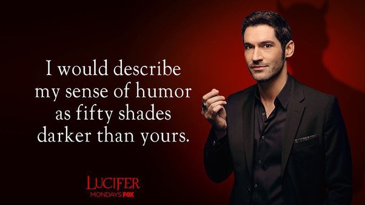

*Réponse publiée [sur Quora](https://fr.quora.com/Quelle-est-la-meilleure-repr%C3%A9sentation-de-Satan-du-Diable-ou-de-tout-autre-%C3%A9quivalent-au-cin%C3%A9ma-ou-%C3%A0-la-t%C3%A9l%C3%A9vision/answer/Dr-Goulu)*

J'ai bien aimé celui de la [série télévisée Lucifer](w:Lucifer_(série_télévisée)) (les 2 premières saisons, après ça part vraiment en vrille)

On se prend d'affection pour ce pauvre Lucifer, condamné pour l'éternité à l'enfer comme les damnés, qui ont au moins pu profiter un peu des péchés agréables de la vie mortelle, eux… Normal qu'il veuille aussi y goûter un peu, non ? Par pure curiosité scientifique ;-)

Mais bon je suis peut-être biaisé par un copain qui lui ressemble énormément, physiquement, dans les attitudes et dans l'humour noir pince sans-rire.

J'aime bien aussi la torture éternelle infligée aux damnés : simplement revivre perpétuellement leurs regrets…

