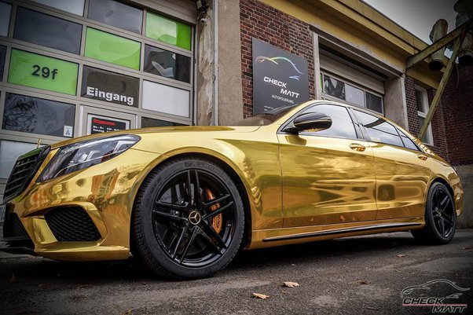

*Réponse publiée [sur Quora](https://fr.quora.com/Existe-t-il-des-voitures-en-or-ou-en-peinture-or/answer/Dr-Goulu)*

L'or est un très mauvais matériau de construction mécanique. Trop mou, trop lourd, fond à basse température, et très cher…

Quelques amoureux de bling-bling ont doré leur voiture à la feuille d'or (la peinture c'est pas assez cher. mon fils…") :

mais ils n'en ont pas trop profité :

[https://www.lunion.fr/id59558/ar...](https://www.lunion.fr/id59558/article/2019-04-21/sa-porsche-recouverte-de-feuilles-dor-estimee-trop-eblouissante-par-la-police)
