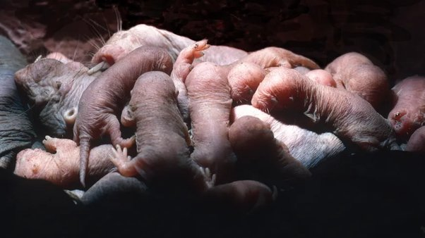

*Réponse publiée [sur Quora](https://fr.quora.com/Les-b%C3%A9b%C3%A9s-mammif%C3%A8res-sont-ils-con%C3%A7us-pour-%C3%AAtre-mignons-ou-est-ce-nous-les-humains-qui-sommes-faits-pour-les-trouver-mignons/answer/Dr-Goulu)*

Ni l'un ni l'autre. Ils ne sont pas mignons et nous ne sommes pas faits. Tout ceci est un résultat de l'évolution. Preuve:

Voici de mignons bébés rats taupes nus têtant leur magnifique mère, n'est ce pas émouvant ?

Ca montre que même la notion de beauté est relative à l'espèce.

Tout cela, l'amour, la gloire, la beauté, ce sont des résultats de l'extraordinaire diversité produite par l évolution. Dan Dennett l'explique super bien dans cette conférence

[https://www.drgoulu.com/2009/03/...](https://www.drgoulu.com/2009/03/25/pourquoi-on-aime-le-joli-le-sexy-le-sucre-et-le-drole/#.YoVY2mm-g0E)

Une espèce pratiquant la stratégie du gros œuf survit mieux si les parents s'occupent bien des pwtits, et le fait de les trouver mignons aide.
