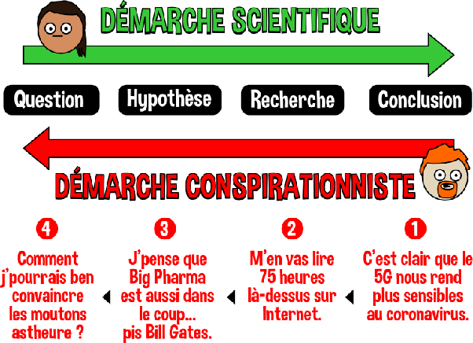

*Réponse publiée [sur Quora](https://fr.quora.com/Que-se-passerait-il-si-le-climat-sur-Terre-montrait-d%C3%A8s-%C3%A0-pr%C3%A9sent-des-signes-%C3%A9vidents-et-indiscutables-de-retour-%C3%A0-la-normale-mettant-ainsi-un-terme-au-r%C3%A9chauffement-climatique-et-aux/answer/Dr-Goulu)*

Et bien on étudierait ça avec énormément d'intérêt comme tous les phénomènes surprenants.

C'est d'ailleurs arrivé avec la [Pause du réchauffement climatique](w:)de 1998 à 2013, qui a permis de mieux comprendre l'effet des courants océaniques

Mais en science on a appris dans la douleur à ne pas mettre la charrue avant les bœufs. D'abord on observe des faits mesurables et indiscutables, et ensuite on les explique, pas le contraire.

([Dans la tête d'un conspirationniste - Le Pharmachien](https://lepharmachien.com/conspirations/))
