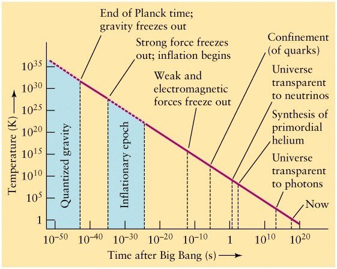

*Réponse publiée [sur Quora](https://fr.quora.com/Le-Big-Bang-sugg%C3%A8re-t-il-forc%C3%A9ment-un-d%C3%A9but-donc-une-forme-de-cr%C3%A9ation/answer/Dr-Goulu)*

Non.

Le [Big Bang](w:)

> est associé à toutes les [théories](w:Théorie) qui décrivent notre Univers comme issu d'une dilatation rapide. Par extension, il est également associé à cette époque dense et chaude qu’a connue l’Univers il y a 13,8 milliards d’années, sans que cela préjuge de l’existence d’un « instant initial » ou d’un commencement à son histoire
>
>
>
> [— Wikipédia](w:Big_Bang)

Si vous représentez l'[Histoire de l'Univers](w:)sur une échelle de temps logarithmique , vous obtenez ça :

(source [Lecture 32: The Early Universe](https://sites.ualberta.ca/~pogosyan/teaching/ASTRO_122/lect32/lecture32.html) )

qui montre qu'il s'est passé beaucoup plus de choses (= interactions) "pendant" le Big Bang que depuis jusqu'à maintenant, et que l'expansion de l'Univers actuelle n'est "que" la continuation de ce processus.

On n'a aucune idée de ce qu'il y avait encore plus à gauche parce que c'est inaccessible voire contradictoire à notre physique, mais on a aucune raison de penser qu'il y a eu une discontinuité, et encore moins le "néant".
