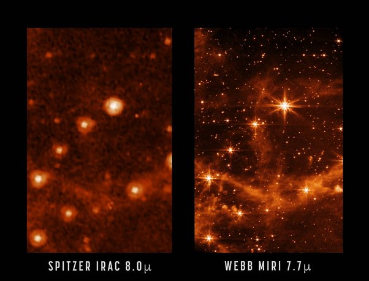
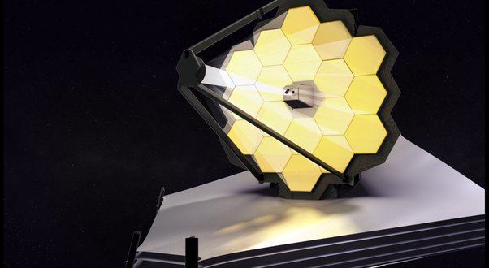

*Réponse publiée [sur Quora](https://fr.quora.com/Les-premiers-clich%C3%A9s-du-t%C3%A9lescope-James-Webb-dans-linfrarouge-sont-ils-prometteurs-pour-lavenir/answer/Dr-Goulu)*

Les premières images a contenu scientifique sont attendues pour juillet (les chercheurs qui ont commandé l'observation ont la primauté des résultats pendant 1 ou 2 mois), alors pour l'instant il faut se contenter d'images de calibration comme celle-ci, prise au même endroit que [Spitzer](w:Spitzer_(télescope_spatial))pour comparer :

Je dirais qu'il n'y a pas photo …

Ce qui surprend un peu, ce sont les aigrettes de diffraction, les "pointes des étoiles"

[https://bigthink.com/starts-with...](https://bigthink.com/starts-with-a-bang/james-webb-spikes/)

ça vient du support du miroir secondaire, qui a 3 pattes et bizarrement pas à 120° les unes des autres …

voir

[https://www.drgoulu.com/2009/01/...](https://www.drgoulu.com/2009/01/17/inventaire-des-croix-du-ciel/)
