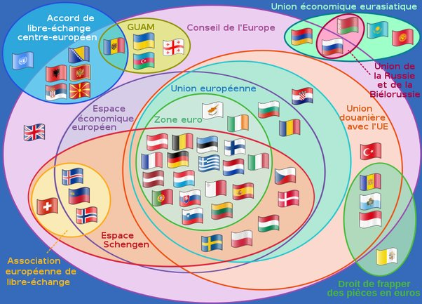

*Réponse publiée [sur Quora](https://fr.quora.com/Il-y-a-actuellement-27-nations-dans-lUnion-europ%C3%A9enne-et-parmi-celles-ci-8-pays-ne-font-pas-partie-de-la-zone-euro-le-syst%C3%A8me-mon%C3%A9taire-unifi%C3%A9-utilisant-leuro-Le-Danemark-est-l%C3%A9galement/answer/Dr-Goulu)*

Chaque fois que j'essaie d'y comprendre quelque chose, je regarde ce superbe graphique que l'on trouve sur plusieurs pages de [Wikipédia, par exemple Zone euro:](w:Zone_euro)

Le texte mentionne que :

> - Le [Danemark](w:Euro_et_Danemark), qui a voté non au [traité de Maastricht](w:Traité_sur_l'Union_européenne) avant d'obtenir quatre dérogations (dont deux ne sont plus en vigueur) dont l'une sur la monnaie unique, a refusé l'euro par référendum le 28 septembre 2000. . Aucun nouveau référendum n'a été fixé à ce jour
> - les sondages d'opinions montrent l'approbation ou le refus des populations à intégrer la zone euro. Au Danemark (71 %) et en Suède (87,6 %), l'opposition y est encore forte et constante à ce jour. En Tchéquie (70 %) et en Pologne (75 %) l'opposition y est majoritaire depuis la crise économique de 2008

Votre question qui demande pourquoi "Le Danemark est légalement exempté d'adopter l'euro" est "à l'envers" : les pays doivent faire la demande de l'adopter, et certains pays ne veulent pas.

Remarquez les pays en bas à droite on le droit de frapper des euros, mais ne font pas partie de la Zone Euro ! Il y en a même un qui n'est même pas dans le Conseil de l'Europe ! Saurez-vous trouver quels sont ces pays ?
