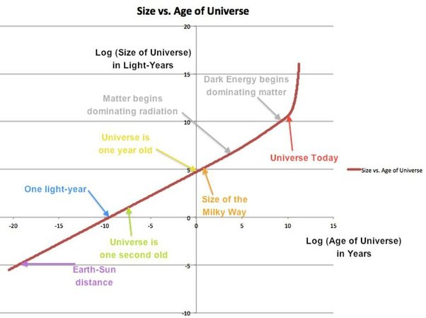

*Réponse publiée [sur Quora](https://fr.quora.com/Savons-nous-combien-de-temps-la-singularit%C3%A9-a-exist%C3%A9-avant-le-Big-Bang/answer/Dr-Goulu)*

Une singularité est un objet mathématique, ça ne correspond à rien de réel (jusqu'à preuve du contraire)

En l'occurrence, cette singularité apparaît lorsqu'on remonte le temps de façon "linéaire", seconde après seconde.

Si on se dit que la seconde n'avait aucun sens à l'époque où rien n'avait ni le temps ni la place d'osciller et qu'on remplace le temps par des unités adaptées comme la densité d'énergie, l'entropie ou la température, alors il n'y a pas de singularité : le Big Bang s'étale depuis (moins) l'infini et l'expansion de l'Univers n'est que la suite de ce processus de transformation de l'univers .

On trouve plus souvent des représentations de ceci avec une échelle de temps logarithmique, par exemple :

source : [How small was the Universe when the hot Big Bang began?](https://bigthink.com/starts-with-a-bang/small-universe-big-bang/)

(tiens, faudrait que je traduise [Logarithmic timeline - Wikipedia](w:en:Logarithmic_timeline) en français…)
