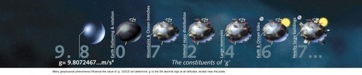

*Réponse publiée [sur Quora](https://fr.quora.com/L-attraction-terrestre-est-elle-due-%C3%A0-la-masse-terrestre-ou-%C3%A0-son-moment-cin%C3%A9tique-Combien-les-deux-se-divisent-ils-sur-981-m-s/answer/Dr-Goulu)*

Faites l'expérience !

Reproduisez l'[Expérience de Cavendish](w:)en utilisant des sphères tournantes au lieu des fixes, et si vous trouvez une valeur de G qui varie avec la vitesse de rotation des sphères (donc leur moment cinétique), vous gagnez un Prix Nobel, promis juré !

En attendant, la réponse est que l'attraction gravitationnelle ne dépend que des masses.

Mais l'accélération (vers le haut…) d'un objet à la surface de la Terre ne dépend pas que de la gravitation. les autres effets et leur importance sont bien montrés dans ce joli graphique :

je vous traduis et commente les textes :

- (9.8 : masse)
- 0 : aplatissement de la Terre et rotation. Comme ça correspond à la deuxième décimale de presque 10, ça cause donc une variation de 1/1000 ème environ
- 7 : montagnes et fosses océaniques, donc influence du relief : 1/10'000 ème environ
- 2 : distribution de la masse du sous-sol: 1/100'000 ème environ
- 4 : grands réservoirs (océans, où la densité est inférieure à la moyenne en surface) 1 ppm
- 6 : marées. Un dixième de millionième. Oui, seulement.
- 7 : grands bâtiments à proximité. Oui l'Arche de la Défense vous attire vers le haut, et oui, ça peut actuellement se mesurer !
- … [Astrologie](https://www.drgoulu.com/2004/06/30/astrologie/)
