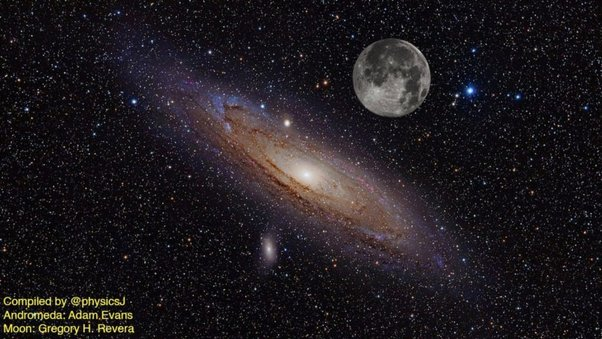

*Réponse publiée [sur Quora](https://fr.quora.com/Comment-peut-on-reconna%C3%AEtre-une-galaxie-dune-%C3%A9toile/answer/Dr-Goulu)*

A l'œil nu, dans l'hémisphère nord, vous ne pouvez voir qu'une seule galaxie à part la Voie Lactée : Andromède.

Et elle est ÉNORME :

L image est un montage, mais les tailles apparentes relatives sont correctes !

A l'œil nu vous ne verrez que le noyau central, un peu flou. Mais ce que vous voyez aussi, c'est que les centaines de milliards d'étoiles qui composent Andromède sont indiscernables. Bon, avec un excellent téléscope on peut encore tout juste mais c'est limite. Donc en gros :

Si c'est net, c'est une étoile,

Si c'est flou et loin, c'est une galaxie

Si c'est flou et près, c'est une nébuleuse.

Avec un télescope amateur, on peut encore confondre des nébuleuses avec des galaxies, voire avec des étoiles si le télescope est mal réglé, mais avec des télescopes professionnels aucun risque :

le spectre d'une étoile est un spectre de corps noir correspondant à la température de l'étoile, alors que le spectre d'une galaxie est tout étalé, étant la somme de milliards d'étoiles de températures variées.
