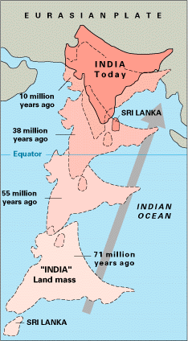

*Réponse publiée [sur Quora](https://fr.quora.com/Pourquoi-les-plus-hauts-sommets-des-montagnes-sont-de-la-cha%C3%AEne-himalayenne/answer/Dr-Goulu)*

Parce que la [Plaque indienne](w:)percute la plaque eurasiatique à la vitesse record de 6 cm par an.

La "tôle froissée" par cette collision s'élève depuis 50 millions d'années, parfois de 1cm par an en certains points de l'[Himalaya](w:)

Schéma de l'accident pour l'assurance :

Le sommet de l'Everest est fait de calcaire marin, c'était un récif de corail de l'océan qu'il y avait entre les deux plaques.

Cela dit on peut discuter des " plus hauts sommets".

Le volcan [Mauna Kea](w:)d'Hawaii ne faut que 4207m au dessus de la mer, mais 5000m en dessous. Total géologique : 9207m.
