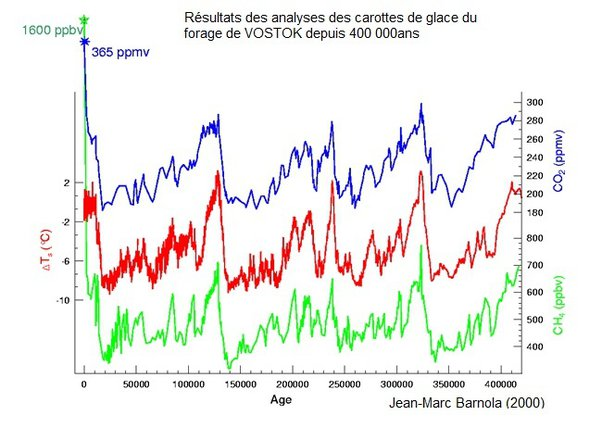
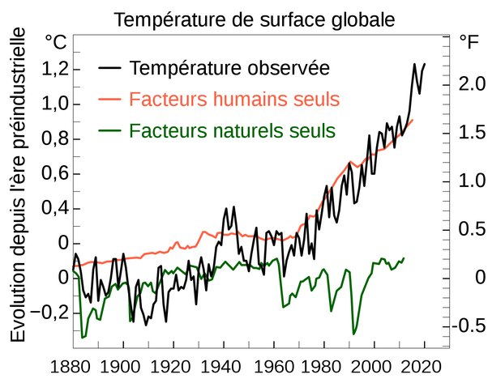

*Réponse publiée [sur Quora](https://fr.quora.com/Quelles-sont-les-causes-naturelles-du-changement-climatique/answer/Dr-Goulu)*

L'actuel réchauffement ? Aucune.

Nous étions déjà sur une [Période interglaciaire](w:)correspondant à une période chaude due aux [Paramètres de Milanković](w:)de l'orbite terrestre. Le Soleil ne brille pas plus fort, il n'y a pas eu de dégagement naturel de masses anormales de CO2 ou de méthane.

La température de surface n'a jamais augmenté aussi vite, de plus de 1°C en un siècle, et les quantités de méthane et de CO2 dans l'atmosphère n'ont jamais été aussi élevée en 400'000 ans

Rétrospectivement, on peut simuler les températures qu'il y aurait eu sous l'effet des divers phénomènes naturels enregistrés (cycle solaire, éruptions volcaniques, et ceux qu'il y aurait eu en ne tenant compte que des activités humaines :

Il n'y a qu'une seule cause du réchauffement climatique actuel : Homo Sapiens.
