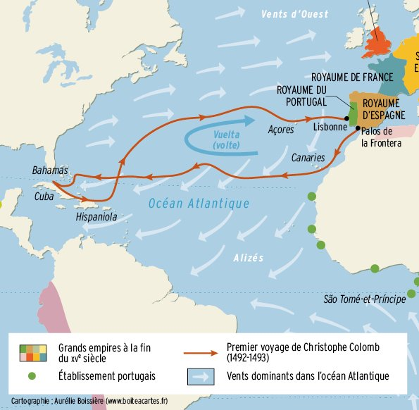

*Réponse publiée [sur Quora](https://fr.quora.com/Comment-Christophe-Colomb-connaissait-il-le-meilleur-endroit-o%C3%B9-traverser-l-oc%C3%A9an-Atlantique/answer/Dr-Goulu)*

Beaucoup de gens ne réalisent pas que le problème n'etait pas d'aller vers l'Amérique, mais d'en revenir.

Pour y aller, les alizés soufflent vers l'ouest régulièrement, poussant n'importe quel rafiot à voiles carrées des Canaries vers les Caraïbes.

Par contre, pas moyen de les remonter 'au près" pour revenir : il faut remonter bien au nord et rentrer poussé par les dépressions polaires qui peuvent être violentes.

Christophe Coulomb a bénéficié de conditions favorables à son époque pour trouver les vents favorables plus au sud que d' habitude, sinon il aurait été dévoré par un serpent de mer géant, ou serait tombé du bord du monde comme ses prédécesseurs.

Christophe Colomb n'est pas le premier européen à avoir atteint l Amérique, les vikings l'ont fait 300 ans avant lui, mais il est probablement le premier à en être revenu.

