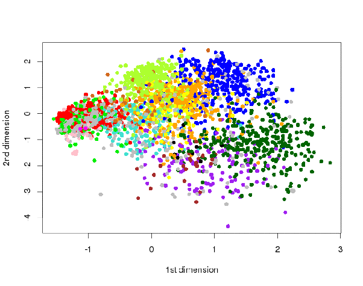

*Réponse publiée [sur Quora](https://fr.quora.com/Pourquoi-l-%C3%A9cologie-en-politique-est-elle-clairement-%C3%A0-gauche-Pourquoi-ne-serait-elle-pas-plut%C3%B4t-centriste/answer/Dr-Goulu)*

En Suisse nous avons deux partis écologistes : les Verts et les [Vert'libéraux](w:)qui se voulaient initialement "de droite", ou du moins voulaient s'appuyer sur l'économie libérale.

Nous avons aussi un remarquable outil de mesure décrit ici [[1]](#iAIjs) [[2]](#nTGSa), qui permet d'établir cette carte du positionnement politique des partis

(smartmap du parlement suisse 2015)

On voit que les Verts (en vert clair) se superposent parfaitement aux socialistes (en rouge) à gauche, alors que les Verts libéraux (vert pomme) s'en distinguent assez nettement en étant moins à gauche, mais aussi plus haut selon le deuxième axe qui traduit le progressisme.

Ils sont pratiquement au dessus du parti du Centre, orange. En fait il suffirait qu'ils deviennent pro nucléaires pour que je vote pour eux…

Ce qui est étonnant, c'est plutôt que les Verts "de gauche" ne se décalent pas de la même manière. En fait ils sont en train de phagocytes les socialistes, qui vont se retrouver obligés de devenir plus conservateurs (en bas), donc plus près du communisme de grand papa pour survivre.

Bref, les Verts sont en train de devenir la gauche, et les Vert'libéraux le centre progressiste.

Il n'y a pas de verts de droite car il n'y a pas de place sur le graphique à droite : la droite à deux partis, le PLR progressiste en haut (bleu) et l'UDC conservatrice en bas (vert foncé)

Vous avez la même configuration en France avec 2 partis de droite.

Notes de bas de page

[[1]](#cite-iAIjs)[La smartmap: anatomie de la carte politique – smartvote Blog](https://blog.smartvote.ch/fr/la-smartmap-anatomie-de-la-carte-politique/)

[[2]](#cite-nTGSa)[La politique française dans la 2ème dimension ? - Pourquoi Comment Combien](https://www.drgoulu.com/2017/05/14/la-politique-francaise-dans-la-deuxieme-dimension/#.YuqTuKS-g0E)
