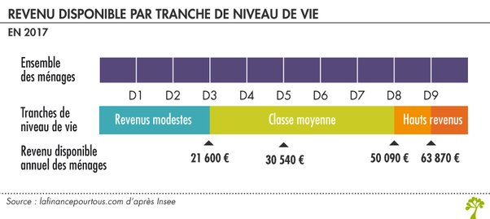

*Réponse publiée [sur Quora](https://fr.quora.com/%C3%80-partir-de-quel-salaire-mensuel-net-avant-imp%C3%B4ts-consid%C3%A9rez-vous-quelqu-un-sans-patrimoine-comme-riche/answer/Dr-Goulu)*

> **riche :***adjectif et nom masculin :*Qui a de la fortune, possède des richesses.

Donc sans patrimoine on est pas riche. Si vous gagnez 10'000 euros par mois mais que vous les cramez en cocaïne, en putes et au casino, vous dormirez sous les ponts comme un sdf.

Et il y a des retraités qui ont de la peine à payer l'impôt sur la fortune immobilière de la maison dont ils ont hérité …

Votre INSEE parle plutôt de "niveau de vie" en fonction du "revenu disponible du ménage", donc après impôts et autres charges obligatoires

source et explications : [Niveau et composition des revenus moyens en France - La finance pour tous](https://www.lafinancepourtous.com/decryptages/finance-perso/revenus/niveau-et-composition-des-revenus-moyens-en-france/)
