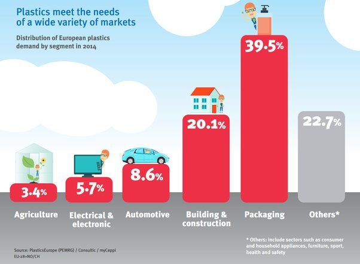

*Réponse publiée [sur Quora](https://fr.quora.com/Pourquoi-quand-on-parle-plastique-ICI-tous-le-monde-pense-emballage-et-produits-jetables-oubliant-tous-les-autres-usages/answer/Dr-Goulu)*

Parce que c'est quand même les 2 plus gros usages (les produits jetables sont dans la colonne "others"), qui totalisent plus de 60% de la consommation en Europe.

source: [C’est quoi le problème avec le plastique ?](https://www.ecoconso.be/fr/content/cest-quoi-le-probleme-avec-le-plastique)

Et j'ose pas imaginer dans les pays qui ne produisent pas d'électronique ni de voitures et construisent avec des matériaux locaux. Dans certains pays en développement (ceux où on voit encore des sacs en plastique voler à chaque coup de vent), ça doit être près de 90%
