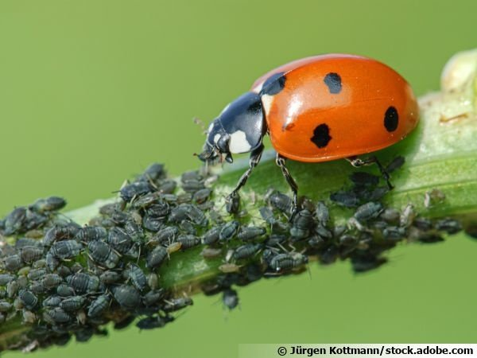

*Réponse publiée [sur Quora](https://fr.quora.com/Quel-est-linsecte-le-plus-impitoyable-du-r%C3%A8gne-animal/answer/Dr-Goulu)*

La pitié n'existe pas chez les animaux, en tout cas pas les insectes.

L'exemple choisi par [Paul Colinvaux](w:en:Paul_Colinvaux)dans "les manèges de la vie" pour illustrer la férocité extrême est la coccinelle.

Une seule coccinelle peut anéantir un troupeau d'une centaine de pucerons en quelques minutes, ne laissant aucune chance de survie à ses proies qu'elle transperce de sa trompe avant d'aspirer leurs organes vivants.

Ca doit être un tortionnaire de l'inquisition qui l'a baptisée "bête à Bon Dieu"…

(Le prédateur le plus féroce du monde en plein carnage. source : [La lutte biologique, une solution naturelle et écologique](https://www.aujardin.info/fiches/lutte-biologique-solution-naturelle-ecologique.php) )
