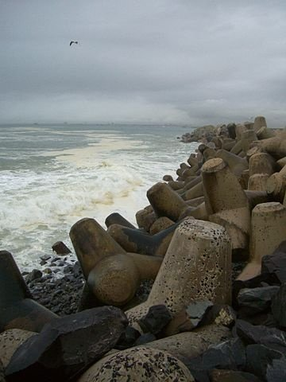

*Réponse publiée [sur Quora](https://fr.quora.com/Pourquoi-la-foret-semble-aspirer-tout-le-bruit/answer/Dr-Goulu)*

Deux raisons

1. le bois absorbe très bien les vibrations. Mon prof de matériaux disait qu'il y en a toujours dans les skis parce qu'on a jamais rien trouvé de mieux pour ça (en fait si, mais c'est beaucoup plus cher). Tout bon auditorium a des surfaces de bois pour absorber le son, sinon vous avez un écho terrible. Je pense que c'est vrai aussi pour les autres matériaux qui composent la végétation, parce qu'ils ne doivent pas se mettre en résonnance sous l'effet du vent sous peine de casser.
2. la forme "fractale" des arbres et leur disposition aléatoire. Vous avez surement déjà vu des digues artificielles formées de "tétrapodes" comme celle-ci :

(photo d' Adam Brink, Cape Town sur [Tétrapode (structure) — Wikipédia](w:Tétrapode_(structure)) )

Vous avez peut-être remarqué que ces blocs ne sont pas disposés régulièrement, mais au hasard. C'est voulu : une digue sans régularité absorbe beaucoup mieux les vagues en les fractionnant en une ribambelle de vaguelettes de différentes tailles qui interfèrent dans tous les sens.

Idem dans une forêt : votre son va être diffusé dans tous les sens très rapidement.
