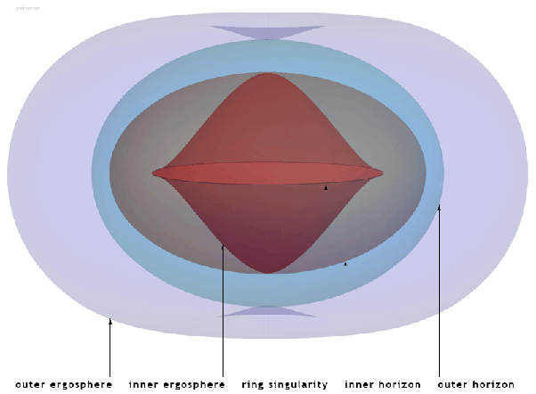

*Réponse publiée [sur Quora](https://fr.quora.com/Lhorizon-des-%C3%A9v%C3%A8nements-dun-trou-noir-d%C3%A9limite-t-il-une-sph%C3%A8re-parfaite/answer/Dr-Goulu)*

Pour un [Trou noir de Schwarzschild](w:)(= qui ne tourne pas) oui, mais ils n'existent pas.

Les vrais trous noirs sont des [Trous noirs de Kerr](w:Trou_noir_de_Kerr), qui tournent extrêmement vite, et selon la métrique qui les caractérise[[1]](#vdFxD) ils ont 4 surfaces qui délimitent autant de zones où se passent des choses étranges… (et définissent autant de questions à poser sur Quora…)

Les deux horizons externes et internes sont des ellipsoïdes, alors que les ergosurfaces qui délimitent l'[Ergosphère](w:)ont des formes un peu plus compliquées, qui dépendent du [Paramètre de Kerr](w:) :

A vitesse de rotation nulle, ces 4 surfaces se combinent pour donner l'horizon sphérique d'un trou noir de Schwarzschild, et aucun trou noir ne peut tourner assez vite pour qu'elles s'interpénètrent , ce qui permettrait de voir leur singularité nue…

La [Censure cosmique](w:)y veille…

[https://www.drgoulu.com/2016/07/...](https://www.drgoulu.com/2016/07/10/combien-tourne-un-trou-noir)

Notes de bas de page

[[1]](#cite-vdFxD)[Kerr metric - Wikipedia](w:en:Kerr_metric)
