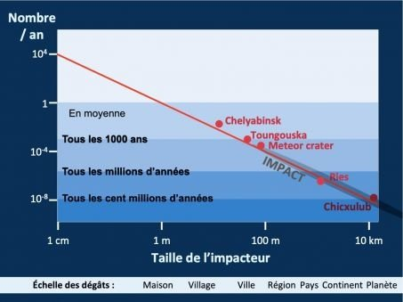

*Réponse publiée [sur Quora](https://fr.quora.com/Est-ce-que-nous-ressentirions-les-effets-de-limpact-dune-m%C3%A9t%C3%A9orite-dune-tonne-dans-une-zone-d%C3%A9sertique/answer/Dr-Goulu)*

Non.

Des météorites d'une tonne (~1m de diamètre) il en tombe environ une par année sur Terre :

(source : [Une météorite a éclairé le ciel de la Bretagne - Sciences et Avenir](https://www.sciencesetavenir.fr/espace/une-meteorite-tres-rapide-a-eclaire-le-ciel-de-la-bretagne-l-astrophysicienne-brigitte-zanda-de-vigie-ciel-repond-a-nos-questions_157315) )

le plus souvent elle tombe dans la mer, ou dans des zones désertiques ou peu peuplées.

Celles-ci sont beaucoup plus étendues que l'on croit : [La moitié de la population mondiale occupe 1 % du territoire](https://www.lepoint.fr/societe/la-moitie-de-la-population-mondiale-occupe-1-du-territoire-14-01-2016-2010063_23.php#11) .

Donc il faudrait vraiment beaucoup de malchance pour qu'une telle météorite détruise une maison (pas plus…), ou un sacré coup de chance pour qu'elle tombe assez près d'un sismographe pour qu'on puisse détecter sa chute.

[https://www.drgoulu.com/2012/01/...](https://www.drgoulu.com/2012/01/28/risques-meteoritiques/#.Y2wB4HZsOCo)
