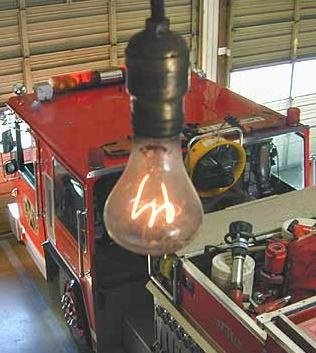

*Réponse publiée [sur Quora](https://fr.quora.com/Est-il-vrai-qu-une-ampoule-%C3%A0-Livermore-en-Californie-brille-depuis-1901-Pourquoi-ne-fait-on-plus-d-ampoules-comme-%C3%A7a/answer/Dr-Goulu)*

Elle ne brille pas vraiment, elle arrive à peine à chauffer son filament :

La résistance de son filament en carbone a augmenté avec le temps. Conçue pour une puissance de 60W, elle ne consomme plus que 4W aujourd’hui. La luminosité de l’ampoule est donc désormais 0.3% de sa luminosité originelle pour 4/60 = 7% de sa puissance électrique originelle. Son rendement a donc chuté d’un facteur 24.

On en fait plus des comme ça parce que c'est une catastrophe énergétique.

[https://www.drgoulu.com/2011/10/...](/2011/10/16/la-veritable-histoire-de-lampoule-de-livermore/#.Y3aQ9HZsOCo)
