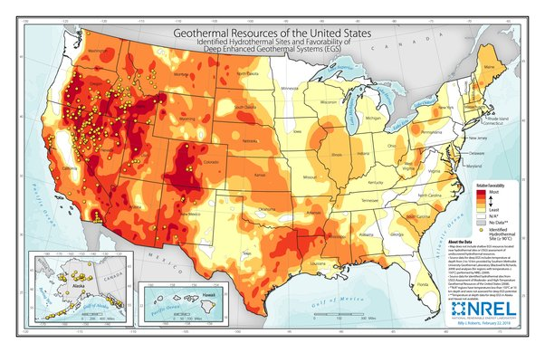

*Réponse publiée [sur Quora](https://fr.quora.com/Est-il-possible-et-rentable-de-r%C3%A9cup%C3%A9rer-l%C3%A9nergie-g%C3%A9othermique-du-Yellowstone-USA-comme-en-Islande/answer/Dr-Goulu)*

Les USA sont déjà le [premier producteur d'électricité géothermique du monde](w:Centrale_géothermique), avec une part de plus de 20%. Leurs [Centrales géothermiques](w:en:List_of_geothermal_power_stations_in_the_United_States) produisent 18 TWh par an, 6x plus que l'Islande.

cette carte montre le potentiel géothermique des USA, avec les points jaunes aux endroits exploités:

(source NREL [Map of potential geothermal resources across the United States](https://www.americangeosciences.org/critical-issues/maps/geothermal-energy-resource-US) )

Yellowstone (à peu près là où est écrit "Idaho" sur la carte) est un parc national, c'est la seule raison pour laquelle il ne peut légalement pas être exploité[[1]](#nhrve)

Mais il y a quand même un projet un peu fou visant surtout à refroidir l'énorme bulle de magma qui se développe peu à peu, et ça permettrait en effet de produire pas mal d'électricité au passage. Ou de déclencher l'éruption …

[https://atlantico.fr/article/atl...](https://atlantico.fr/article/atlantico-light/yellowstone--le-projet-fou-de-la-nasa-pour-refroidir-le-supervolcan)

Notes de bas de page

[[1]](#cite-nhrve)[Can we use the heat from Yellowstone for energy?](https://www.usgs.gov/faqs/can-we-use-heat-yellowstone-energy)
