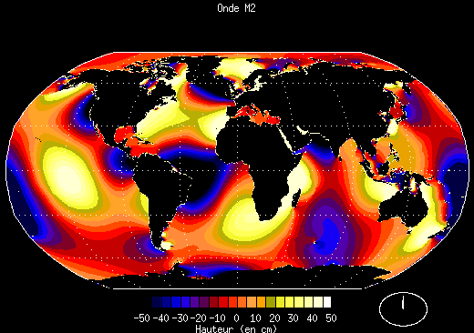

*Réponse publiée [sur Quora](https://fr.quora.com/L-effet-des-mar%C3%A9es-%C3%A9tant-diff%C3%A9rent-entre-la-mer-M%C3%A9diterran%C3%A9e-et-l-oc%C3%A9an-Atlantique-quel-est-son-effet-au-niveau-du-d%C3%A9troit-de-Gibraltar/answer/Dr-Goulu)*

D'après [Get Ceuta Strait of Gibraltar's tide times](https://www.tideschart.com/Spain/Ceuta/Ceuta/Ceuta-Strait-of-Gibraltar) , il y a des marées d'environ 1m

Les marées, c'est compliqué :

([Combien de marée - Pourquoi Comment Combien](https://www.drgoulu.com/2017/08/15/combien-de-maree/#.Y5MMM3ZsOCo) )

Globalement vous avez des marées de 1m environ côté Atlantique, et quasi nulles côté Méditerranée : la vague de marée est totalement "amortie" au passage du détroit, ce qui cause des courants de 2 nœuds environ dans un sens puis dans l'autre ( voir [Le détroit de Gibraltar](https://www.hisse-et-oh.com/articles/le-detroit-de-gibraltar) )
