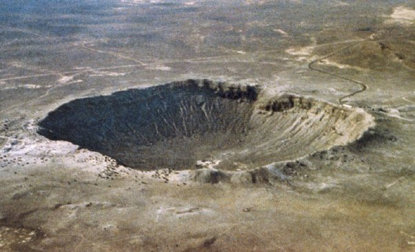

*Réponse publiée [sur Quora](https://fr.quora.com/Quel-ast%C3%A9ro%C3%AFde-g%C3%A9o-croiseur-est-pass%C3%A9-le-plus-proche-de-la-Terre/answer/Dr-Goulu)*

plusieurs sont passés à 0 mètres, voir [Objet géocroiseur # impacts remarquables — Wikipédia](w:Objet_géocroiseur)

[Meteor Crater](w:) (1,2 kilomètre de diamètre), situé aux États-Unis, résulte de l'impact d'un astéroïde de 45 mètres de diamètre qui s'est écrasé il y a 50 000 ans. C'était hier …

Bon, on est pas sur que ces impacts soient tous dus à des géocroiseurs, mais comme en on connait 21'000 qui croisent* par définition l'orbite de la Terre, donc ceci une ou deux fois par année environ, multiplié par des milliards d'années, ça fait que les géocroiseurs sont probablement responsables de 95% des impacts au moins.

Il y a même des astéroïdes qui créent plusieurs impacts… Non ils ne rebondissent pas … Langue au chat ici :

[https://www.drgoulu.com/2009/04/...](https://www.drgoulu.com/2009/04/16/de-manicouagan-a-rochechouart/#.Y-J3ZnZsOCo)

Note* : le terme "croiser l'orbite" n'est pas assez clair : l'orbite de ces objets traverse la sphère dont l'orbite terrestre est l'équateur, donc ils peuvent passer à 2UA de la Terre… L'espace, c'est très vide …
