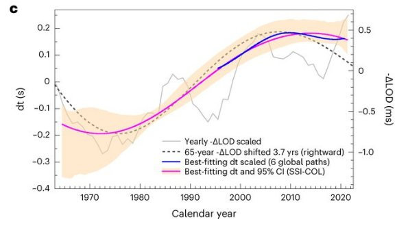

*Réponse publiée [sur Quora](https://fr.quora.com/La-graine-du-noyau-de-la-Terre-s-est-elle-arr%C3%AAt%C3%A9e-de-tourner-Quelles-seraient-les-cons%C3%A9quences/answer/Dr-Goulu)*

Deux questions, deux réponses :

1. non
2. on devrait réviser toute la physique.

Plus clairement, on sait que la vitesse de rotation du noyau est différente de celle de la surface, mais ceux qui croient, et encore pire, ceux qui ont publié que le noyau s'est arrêté devraient apprendre à lire.

Dans cet article récent

[https://www.nature.com/articles/...](https://www.nature.com/articles/s41561-022-01112-z)

[que vous pouvez lire en intégralité ici](https://www.researchgate.net/publication/367351565_Multidecadal_variation_of_the_Earth's_inner-core_rotation), les auteurs disent que la rotation DIFFERENTIELLE varie selon un cycle de 70 ans représenté ici :

Regardez l'échelle à gauche : ce sont des secondes en plus ou en moins des ~24 heures à la surface.

Ca veut dire que d'après eux, le noyau tournait en 23h 59 minutes et 59.8 secondes en 1975 et que là il tourne plutôt en 24h 0 minutes et 0.2 secondes.

C'est ça que signifie rotation DIFFERENTIELLE. Et ça se comprend assez bien si on réalise qu'entre le noyau et la croûte terrestre, il y a des "manteaux" de pâte visqueuse qui font des mouvements de convection, donc que c'est tout à fait compréhensible qu'il y ait un décalage. Ce qui est extraordinaire c'est de pouvoir le mesurer avec une telle précision. Juste : WOW !

Quand des journalistes sportifs vulgarisent un articles scientifique comme ça, ils lisent en diagonale et font le buzz en disant que la rotation du noyau terrestre s'est arrêtée, ou pire qu'il tourne dans l'autre sens parce que cet article montre que la courbe fait un plat (= le noyau ne tourne plus de plus en plus vite) voire redescend (= le noyau ralentit pour se rapprocher des 24h)

Ce coup-ci, il y a eu tellement de journalistes incapables de lire correctement leur article que ces pauvres auteurs chinois ont [publié un correctif](https://www.nature.com/articles/s41561-023-01136-z) dans lequel ils disent qu'ils ont oublié le mot "DIFFERENTIELLE" à un endroit. C'est sympa, parce qu'ils auraient aussi pu dire que ceux qui ont cru que le noyau terrestre pouvait s'arrêter sont complètement cons..tipés par la science la plus élémentaire.

Par pité ne lisez pas les articles scientifiques dans Gala ou Paris-Match !

Analyse d'un cas similaire de survulgarisation

[https://www.drgoulu.com/2013/10/...](https://www.drgoulu.com/2013/10/05/ya-t-il-des-trous-noirs-dans-la-mer/)

Donc je corrige un peu ma réponse sur les conséquences :

Si la rotation DIFFERENTIELLE du noyau oscille de 0.5 secondes tous les 65 ans, il a oscillé comme ça dans les 70 millions de fois depuis la formation de la Terre, donc ça doit pas être trop mauvais …
