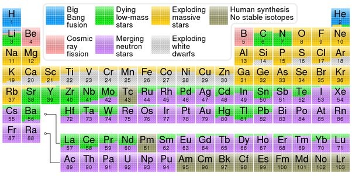

*Réponse publiée [sur Quora](https://fr.quora.com/Quel-est-le-processus-de-fusion-nucl%C3%A9aire-qui-alimente-les-%C3%A9toiles-en-%C3%A9nergie/answer/Dr-Goulu)*

il y en a plusieurs.

Dans les petites étoiles comme le Soleil, c'est la [Chaîne proton-proton](w:)qui fusionne de l'hydrogène en hélium 4 en 3 étapes, passant par la production de deuterium puis d'helium 3.

Quand l'étoile s'étouffe dans son hélium, il se produit le [Flash de l'hélium](w:)qui amorce une [Réaction triple alpha](w:): 3 noyaux d'hélium 4 (appelés "particules alpha" pour des raisons historiques) fusionnent pour produire des quantités colossales de carbone en quelques secondes.

Si l'étoile est assez grosse, c'est alors le [Cycle carbone-azote-oxygène](w:) qui peut démarrer : il fusionne le reste d'hydrogène en hélium4 en 6 étapes formant un cycle.

Ensuite, si l'étoile est assez grosse (5 à 10x la masse du Soleil), il se produit une séquence de fusions de plus en plus courtes qui démarrent à des températures de plus en plus élevées chaque fois que la précédente s’étouffe : la [Fusion du carbone](w:) qui produit du néon, du magnesium et du sodium, [Fusion du néon](w:)qui produit encore plus d'oxygène et du magnesium, [Fusion de l'oxygène](w:) qui produit du silicium, du soufre, du phosphore et encore plus de magnesium, et enfin [Fusion du silicium](w:)qui produit plein de choses mais surtout du fer et du nickel.

Mais le fer et le nickel ne produisent pas d'énergie quand ils fusionnent, ils en consomment.

Donc quand un étoile s'étouffe avec du fer, elle s'effondre et produit une [Supernova](w:) et plein d'éléments fusionnent alors avec plein d'autres pour produire plein d'éléments (en jaune dans la figure ci-dessous) par [Processus r](w:) avant de les expulser dans l'espace en quelques secondes :

Dans certains cas ça ne pète pas, mais le [Processus s](w:)forme les éléments en vert avant de les cracher plus calmement dans l'espace.

Hubert Reeves dit que nous sommes des "poussières d'étoiles" mais c'est un poète.

Il faut voir les choses en face : nous sommes des glaires d'étoiles moribondes.

Une dernière chose en passant : aucune étoile ne produit de l'énergie par fusion Deuterium+Tritium comme nous le faisons dans nos bombes H et comme on aimerait bien le faire dans ITER et autres installations de production d'énergie…
