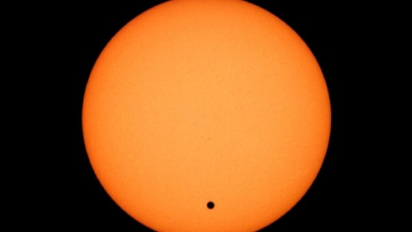

*Réponse publiée [sur Quora](https://fr.quora.com/Pouvez-vous-me-donner-un-exemple-pour-que-je-puisse-visualiser-%C3%A0-quelle-point-le-soleil-est-grand/answer/Dr-Goulu)*

Ceci est une photo réelle d'un [Transit de Vénus](w:), le moment où Vénus passe devant le Soleil, vu de la Terre.

Vénus a à peu près la taille de la Terre.

Si des extraterrestres observent le Soleil, ils voient de temps en temps la luminosité de notre étoile baisser de quelques millionièmes , et si ça arrive périodiquement, ils peuvent en déduire qu'une planète passe devant, à quelle distance du soleil elle se trouve, sa taille et peut être la composition de don atmosphère en observant la différence du spectre de la lumière pendant le transit.

C est ce que nous commençons à être capables de faire pour la [détection des exoplanètes](w:Méthodes_de_détection_des_exoplanètes).
