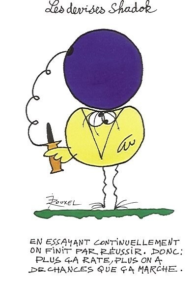

*Réponse publiée [sur Quora](https://fr.quora.com/Aristote-disais-des-math%C3%A9matiques-que-leurs-noblesse-est-de-ne-servir-a-rien-Quen-pensez-vous/answer/Dr-Goulu)*

S'il a dit ça, c'est une des nombreuses conneries d'Aristote.

Il faut arrêter d'encenser les philosophes. Ces types disent n'importe quoi, il y en a toujours un autre pour dire exactement le contraire et après on dit "oh quel grand penseur" pour celui qui a eu du bol de tomber juste sur un sujet donné, et on oublie toutes les autres où il s'est planté.

Les philosophes sont des Shadoks :

Les philosophes qui ont eu du bol au 17ème siècle sont les [Empiristes](w:Empirisme) : [Bacon](w:Francis_Bacon_(philosophe)), [Locke](w:John_Locke), [Condillac](w:Étienne_Bonnot_de_Condillac), [Berkeley](w:George_Berkeley), [Hume](w:David_Hume) inspirés notamment par un astronome arabe du 12ème siècle [Ibn Al Haytham](w:Alhazen), qui ont dit "tiens, et si on validait nos hypothèses par des expériences plutôt que par la raison de cet intello de Descartes ?"

En disant ça ils ont fondé la science moderne et relégué la philo au rang de placebo.

Et les maths sont le langage de la science, Môssieur Aristote.
