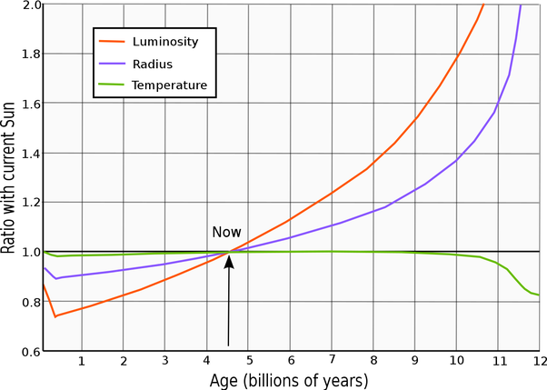

*Réponse publiée [sur Quora](https://fr.quora.com/Avec-une-augmentation-de-20-de-rayonnement-solaire-quelle-serait-les-cons%C3%A9quences-sur-le-monde-vivant-sur-terre/answer/Dr-Goulu)*

Ce sera le cas dans environ 2 milliards d'années. L'évolution du [Soleil](w:)prévoit en effet ceci :

Selon

[https://fr.wikipedia.org/wiki/Ch...](w:Chronologie_du_futur_lointain)

ça posera un problème bien avant, dans un milliard d'années déjà :

> La luminosité solaire a augmenté de 10 %, la température moyenne à la surface de la Terre atteignant 47 °C. L'atmosphère devient une « serre humide », provoquant une évaporation instable des océans. Des poches d'eau pourraient être toujours présentes aux pôles, autorisant quelques refuges pour la vie

A ceux qui pourraient imaginer que le réchauffement climatique est lié à ça, je propose de diviser 10% par un milliard d'années, ça donne une augmentation de la luminosité d'un millionième par siècle.

A comparer avec la variation de 0.1% sur un [Cycle solaire](w:)de 11 ans environ.

Donc non, ça n'a rien à voir.
