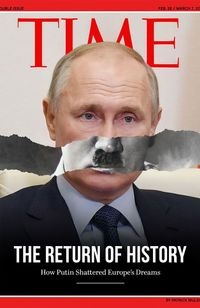

*Réponse publiée [sur Quora](https://fr.quora.com/Les-avions-militaires-de-la-Finlande-le-nouveau-faux-pays-ayant-rejoint-l-OTAN-utilise-des-croix-gamm%C3%A9es-N-est-ce-pas-honteux/answer/Dr-Goulu)*

Ouais, et interdire le papier quadrillé aussi parce que quand j'avais 5 ans, j'ai dessiné des croix gammées dessus en suivant les petits carrés tellement c'était joli.

Et mon faux pays à moi, après avoir accueilli le pognon des juifs, des nazis et de vos copains oligarques russes, va peut être aussi adhérer à l'OTAN grâce à votre Adolf sans moustache préféré.

C est un faux, mais on est plus à ça près, hein, troll ?
