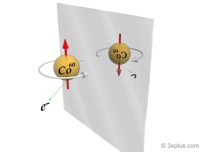

*Réponse publiée [sur Quora](https://fr.quora.com/Pourquoi-la-gauche-et-la-droite-positionnement-dans-lespace-nont-pas-de-d%C3%A9finition-claire/answer/Dr-Goulu)*

il y en a une, mais elle n'est pas triviale. C'est une conséquence de la [non conservation de la Parité par l'interaction faible](w:Parité_(physique)), ou "violation de la symétrie P" :

> En 1956, Mme [Chien-Shiung Wu](http://www.wikipedia.org/search-redirect.php?language=fr&go=Go&search=Chien-Shiung+Wu) démontra une [violation de parité](http://www.laradioactivite.com/fr/site/illustration/images/ViolationParite.htm) concernant la 4ème force, l'[interaction faible](http://www.wikipedia.org/search-redirect.php?language=fr&go=Go&search=interaction+faible). Lors de la désintégration β d’un noyau de Cobalt 60, un électron est émis dans une direction aléatoire. Mais il y en a statistiquement [1 sur un million](http://irfu.cea.fr/Phocea/Vie_des_labos/Ast/ast_technique.php?id_ast=444) de plus qui part dans la direction opposée à celle du spin du noyau que dans la direction du spin (le spin indique le sens de rotation du noyau). En regardant l’expérience dans un miroir le spin change de sens et l’électron irait très légèrement plus souvent dans la direction du spin, ce qui est contraire à l’expérience. L’interaction faible “préfère” très légèrement la rotation à gauche et on pourrait donc expliquer aux extraterrestres notre convention gauche/droite en leur transmettant ce dessin:
>
>
>
> 
>
>
>
> ( [MIROIR | ЯIOЯIM - Pourquoi Comment Combien](https://www.drgoulu.com/2009/04/04/miroir/#.ZDxbf3aiGCo) )
