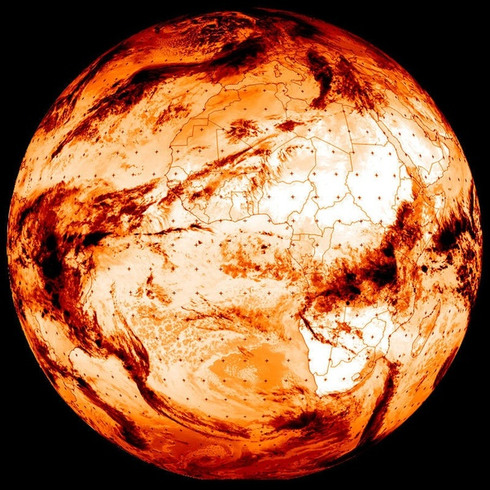
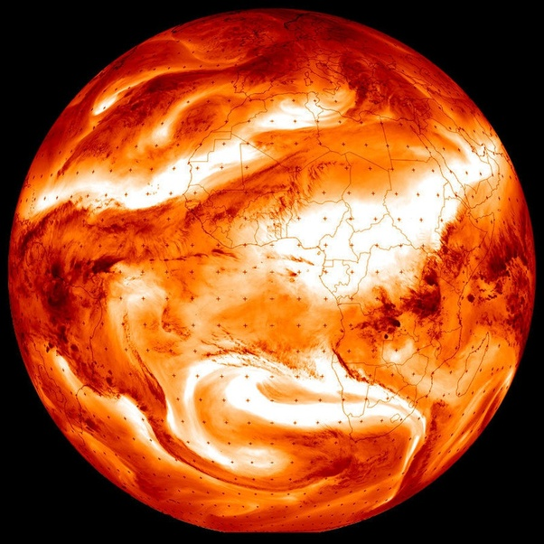

*Réponse publiée [sur Quora](https://fr.quora.com/Quarrive-t-il-%C3%A0-la-temp%C3%A9rature-du-sol-lorsque-laltitude-moyenne-du-rayonnement-infrarouge-de-la-Terre-augmente/answer/Dr-Goulu)*

C'est quoi l "altitude moyenne du rayonnement infrarouge" ?

Vu de l'espace, le rayonnement infrarouge correspond à la température de la surface sauf là où il y a des nuages

> Source - © 2020 D'après EUMETSAT - ESA, colorisé (P. Thollot) La Terre vue par Météosat le 27 janvier 2020 à 10,8 μm (canal dans la fenêtre infrarouge atmosphérique)
>
>
>
> Sur cette image on voit la surface de la Terre sauf là où il y a des nuages (présence d'eau liquide et solide – glace). On repère les limites des continents dont la température se distingue de celle des océans (température plus stable, moins variable au cours de l'année).

Si on observe dans la bande de fréquence correspondant à la vapeur d'eau (le plus important gaz à effet de serre), on voit que ce sont principalement les zones sèches et chaudes qui rayonnent dans l'espace :

> Source - © 2020 D'après EUMETSAT - ESA, colorisé (P. Thollot) La Terre vue par Météosat le 27 janvier 2020 à 6,2 μm (canal dans la bande d'absorption/émission de la vapeur d'eau)
>
>
>
> On voit les masses d'air humides. Plus il y a d'humidité (vapeur d'eau) et plus l'air est “opaque” jusqu'à une altitude plus élevée, où il est plus froid, et réémet donc moins d'IR (d'où une teinte plus sombre). Un air sec est “transparent” et donc très clair, voire blanc.
>
>
>
> La température “déduite” de l'émission de la vapeur d'eau n'indique pas celle du sol mais celle de l'altitude maximale des “masses humides” (la plus proche du satellite) dépendant de la quantité de vapeur d'eau.

le cours d'où sont tirées les images et légendes ci dessus est passionnant :

[https://planet-terre.ens-lyon.fr...](https://planet-terre.ens-lyon.fr/ressource/rayonnement-effet-de-serre.xml)
