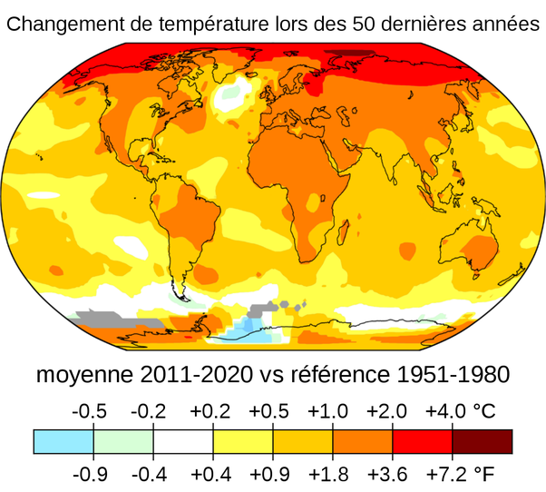

*Réponse publiée [sur Quora](https://fr.quora.com/Est-il-vrai-que-certaines-parties-de-notre-plan%C3%A8te-refroidissent-tandis-que-d-autres-chauffent-davantage-depuis-10-20ans/answer/Dr-Goulu)*

La carte est là:

( Source : [Wikimedia Commons](https://commons.wikimedia.org/wiki/File:Changement_de_la_température_moyenne.svg) Températures moyennes de l'air en surface de 2011 à 2020 par rapport à une moyenne de référence de 1951 à 1980, selon l'Institut Goddard d'études spatiales de la NASA. )

Devinette : pourquoi ya t'il deux petites régions qui refroidissent ?

Regardez bien où elles sont… une idée ? Non ? Près de l'Antarctique et de Groenland ça ne vous inspire pas ?

Langue au chat ?

C'est l'eau de fonte des glaciers qui refroidit l'océan.

Donc même là ce n'est pas une bonne nouvelle.

Du tout.
