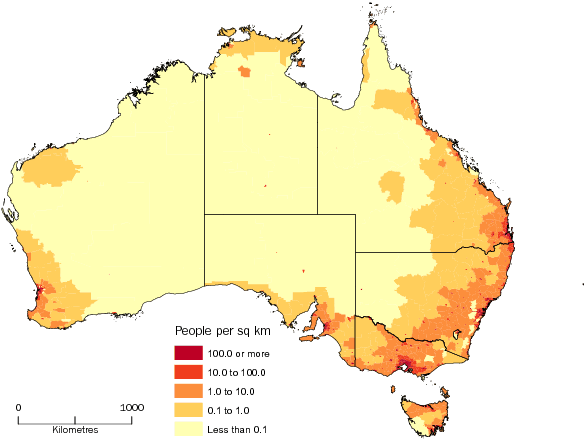

*Réponse publiée [sur Quora](https://fr.quora.com/Pourquoi-lAustralie-est-elle-si-peu-peupl%C3%A9-par-rapport-%C3%A0-sa-superficie/answer/Dr-Goulu)*

Un ami australien me disait là-bas :

> on aurait jamais du permettre aux gens de s'installer n'importe où. Ca coûte hyper cher en infrastructures : routes, lignes électriques, téléphone… on doit donner l'école par radio, on a des médecins qui doivent savoir piloter pour aller en avion chez leur patients… On aurait du se limiter aux villes…

Et effectivement, si vous regardez la carte de la densité de population en Australie :

(source [PopulationData.net](https://www.populationdata.net/cartes/australie-densite-2012/) d'après bureau australien des statistiques)

vous voyez qu'aux abords des grandes villes, la densité atteint celle de la France (106 hab/km2)

Si l'Australie avait la même densité de population moyenne que la France, avec 7.688 millions de km2 elle pourrait loger 814 millions d'habitants. Ce serait le 3ème pays le plus peuplé du monde après la Chine et l'Inde, et avec 2x plus d'habitants que les Etats-Unis.

Le meilleur moyen de savoir pourquoi ce n'est pas le cas, c'est d'aller voir …
