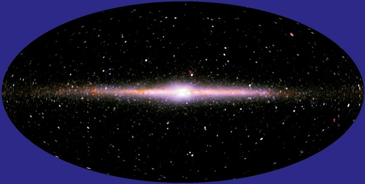
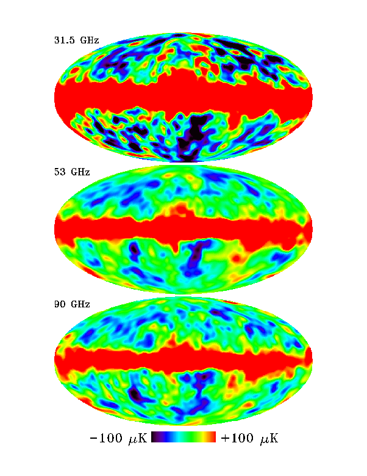
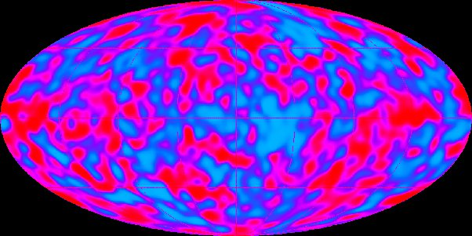

*Réponse publiée [sur Quora](https://fr.quora.com/Comment-peut-on-dessiner-une-carte-compl%C3%A8te-du-fond-cosmologique-alors-quil-y-a-des-galaxies-et-des-%C3%A9toiles-au-travers-du-trajet-de-la-lumi%C3%A8re-primordiale-jusqu%C3%A0-nous/answer/Dr-Goulu)*

En faisant attention ;-)

En fait on mesure le CMB dans l'infrarouge tellement lointain que ce sont plutôt des microondes qui correspondent à un spectre du corps noir de 2.7K, alors que les étoiles et galaxies sont beaucoup plus chaudes. Mais effectivement la partie du spectre de ces objets chauds qui recouvre la bande de fréquences du CMB n'est pas négligeable.

On a donc mesuré en même temps le CMB et les infrarouges "chauds" dans assez de bandes pour pouvoir en reconstituer le spectre du corps noir, puis soustrait la valeur calculée de leur rayonnement microonde de celle mesurée dans le spectre du CMB.

Concrètement, le satellite [COBE](w:en:Cosmic_Background_Explorer)emportait l'instrument [Diffuse Infrared Background Experiment](w:en:Diffuse_Infrared_Background_Experiment)(DIRBE) qui a produit cette image

La grosse tache au centre, c'est notre galaxie qu'on voit en entier par la tranche, avec le centre galactique, une image en elle-même super intéressante pour l'étude de la Voie Lactée.

Le capteur microonde a lui mesuré ceci dans 3 longueurs d'ondes

on voit que la bande centrale donne une mesure de température bien au dessus de ce qu'on attend du CMB, puisque le rayonnement infrarouge de la Voie Lactée s'ajoute.

En soustrayant :

Evidemment, ça c'est la "jolie image pour les journalistes", les scientifiques ont les valeurs mesurés par chaque capteur en chaque point, avec les marges d'erreur, donc là ils savent très bien que les points au milieu de l'image son beaucoup moins fiables que ceux dans le noir de DIRBE.

Alors ils peuvent demander quelques centaines de millions pour [WMAP](w:en:Wilkinson_Microwave_Anisotropy_Probe) puis pour [Planck](w:en:Planck_(spacecraft)), où on a fait le même chose en plus hautes résolutions spatiales et spectrales et en apprenant des missions précédentes pour améliorer le filtre à infrarouges décrit à la louche ci-dessus.
