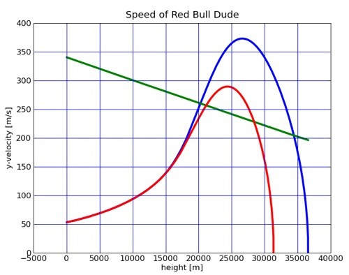

*Réponse publiée [sur Quora](https://fr.quora.com/En-sachant-quun-%C3%AAtre-humain-tombe-en-chute-libre-%C3%A0-200-250-km-h-comment-Baumgartner-a-t-il-pu-franchir-le-mur-du-son/answer/Dr-Goulu)*

Le truc c'est que la vitesse du son décroît à peu près linéairement avec l'altitude

A 25'000m, elle n'est que de 240 m/s au lieu de 330 au niveau du sol. (Courbe verte)

Par contre la vitesse terminale qu'on peut atteindre en piqué avec un casque et une combinaison aérodynamique dépasse largement 300m/s à cette altitude.

Un tel record n'est donc possible qu'à très haute altitude.

Avec la raréfaction de l'air, Félix Baumgartner à dit qu'il n'a même pas senti le passage du mur du son…

Source du graphique et calculs

[https://www.wired.com/2010/02/st...](https://www.wired.com/2010/02/stratos-space-jump/)
