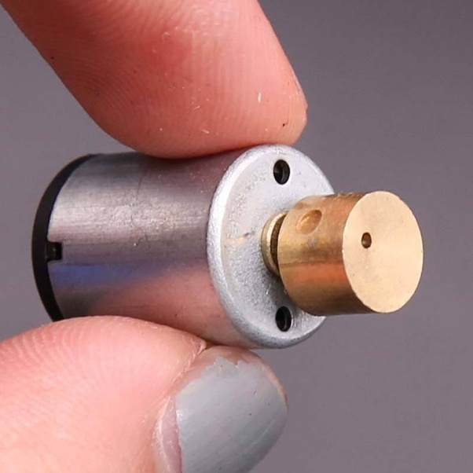

*Réponse publiée [sur Quora](https://fr.quora.com/Comment-est-ce-que-les-t%C3%A9l%C3%A9phones-vibrent-Quelle-est-le-ph%C3%A9nom%C3%A8ne-physique-derri%C3%A8re-la-vibration-du-t%C3%A9l%C3%A9phone-qui-le-fait-donc-bouger-tout-seul/answer/Dr-Goulu)*

Il y a deux questions, dont l'une à déjà été posée sur Quora. Séparez et vérifiez vos questions svp

Les vibreurs sont souvent de petits moteurs qui entraînent une masse décentrée

Ceux des téléphones sont encore plus petits que ça.

Les vibrations se propagent au boîtier du téléphone et modifient légèrement les forces de contact entre le téléphone et la table, ce qui peut produire un minuscule glissement local (effet [Stick-slip —](w:Stick-slip)) dans une direction aléatoire.

Mais si le support est incliné, la moyenne des glissements sera dans le sens de la pente et risque fort de faire tomber votre téléphone…
