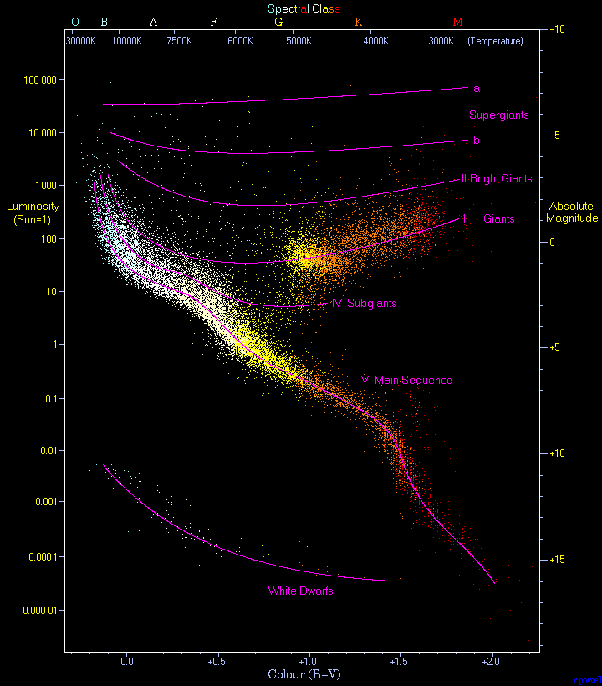

*Réponse publiée [sur Quora](https://fr.quora.com/Comment-comprendre-que-toutes-les-%C3%A9toiles-sont-des-soleils-comme-le-n%C3%B4tre/answer/Dr-Goulu)*

D'abord, vous pouvez mesurer la [parallaxe](w:) de certaines étoiles comme l'a fait [Friedrich Wilhelm Bessel](w:) en 1838. Ça vous donne sa distance et avec un petit calcul tous simple vous pouvez obtenir sa [magnitude absolue](w:) à partir de sa [magnitude apparente](w:) et voir qu'elle correspond à un objet aussi lumineux que le soleil, voire beaucoup plus.

Ensuite vous pouvez monter un [spectroscope](w:Spectroscopie) sur votre telescope, c'est [devenu accessible aux astronomes amateurs](https://www.futura-sciences.com/sciences/actualites/astronomie-spectroscopie-service-astronomes-amateurs-26218/). Vous verrez ainsi que spectre des étoiles correspond à un [Corps noir](w:)d'une température élevée, des milliers de degrés, et vous verrez certainement la [Raie Hα](w:Hα)typique de l'hydrogène. Pour détecter la [raie de l'Helium](http://www.astrosurf.com/rondi/obs/shg/raiesHe.htm) c'est un peu compliqué par la présence d'eau dans notre atmosphère, mais cet élément rare sur Terre est bien abondant dans les étoiles, comme pour notre soleil.

Les étoiles ont donc toutes les caractéristiques de notre soleil, elles sont juste beaucoup plus loin.

Enfin pour achever de vous en convaincre, vous pouvez faire pour chaque étoile un point sur un graphique à une coordonnée X correspondant à sa température de surface mesurée grâce au spectre et à la coordonnée Y correspondant à sa luminosité

Vous allez obtenir le [Diagramme de Hertzsprung-Russell](w:)

Dans lequel on distingue bien des nuages d'étoiles de types proches, notamment la longue [Séquence principale](w:). Le soleil est juste un point dans la partie jaune de celle ci. Dans 4 milliards d années il fera une excursion dans la tache rouge des géantes puis retombera dans les naines blanches.

Comme quasi toutes les étoiles.
