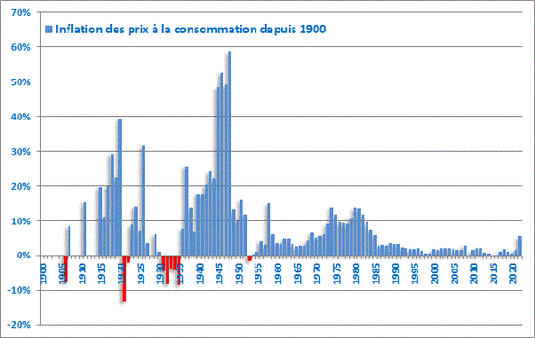

*Réponse publiée [sur Quora](https://fr.quora.com/Pensez-vous-que-linflation-va-sarreter-un-jour/answer/Dr-Goulu)*

A votre avis, de quand date l'inflation ? L'année passée ? Le Covid ?

En fait la derniere année sans inflation en France, c'était 1953.

Et si vous regardez l inflation des années 1970 à 1985, elle était au moins double de ce qu'elle est actuellement, sans parler des 50% annuels pendant la deuxième guerre mondiale…

Donc sauf accident, ce n est pas demain la veille du jour ou vous aurez une inflation = 0%. Et c'est tant mieux car la [Déflation](w:)c'est la catastrophe économique : votre pouvoir d'achat augmente sans rien faire, alors vous retardez au maximum tous vos achats parce que ce sera moins cher demain. Et vous arrêtez toute l'économie…

Donc une petite inflation (1 à 2%)stimule la consommation, donc la production et l'emploi.

En utilisant ce

[https://france-inflation.com/cal...](https://france-inflation.com/calculateur_inflation.php)

Vous verrez que les prix en France ont augmenté d'un facteur 144 entre 1945 et maintenant.

Ceci explique cela :

[https://www.drgoulu.com/2009/04/...](/2009/04/03/combien-vaut-1-franc/)
