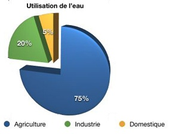

*Réponse publiée [sur Quora](https://fr.quora.com/Seriez-vous-pr%C3%AAt-%C3%A0-prendre-un-bain-tous-les-deux-jours-pour-aider-%C3%A0-r%C3%A9soudre-la-crise-croissante-de-leau/answer/Dr-Goulu)*

Un bain par jour n'est pas qu'une aberration écologique, c'est une aberration tout court.

Deux à trois petites douches par semaine sont amplement suffisantes.

Cela dit le problème n'est pas tellement l'eau : on ne la détruit pas dans un four à haute température pour déchets toxiques quand elle s'écoule de votre salle de bains. Elle va simplement rejoindre les égouts puis sera traitée dans une station d'épuration et rejetée tout à fait propre, voire buvable dans un cours d'eau où elle sera réutilisée par l'agriculture exactement comme si vous n'aviez pas pris de douche ou bain.

Faire moins de toilette ne change donc absolument rien à la "crise croissante de l'eau".

Ca change un peu au niveau de l'énergie puisque j'imagine que vous chauffez un peu l'eau de votre bain, et aussi au niveau de l'énergie nécessaire à la station d'épuration, et aussi parce que vous utilisez de l'eau potable pour vous laver, donc pour la salir au lieu de la boire. Pisser dedans est encore plus aberrant, un véritable scandale par rapport à des pays où l'eau est précieuse et où on se lave et on cuisine (en la faisant bouillir) avec de l'eau de moindre qualité, qu'on utilise ensuite au jardin. Et où on fait ses besoins dans des toilettes sèches, qui servent aussi au jardin …

Si vous voulez aider à la "crise croissante de l'eau", alors mangez des plantes cultivées au goutte à goutte, sous serre voire hors sol, parce que les plus grands utilisateurs d'eau sont les agriculteurs, qui en utilisent plus du double du nécessaire en moyenne planétaire, et là l'eau utilisée est évaporée dans l'atmosphère donc perdue jusqu'à la prochaine pluie.

