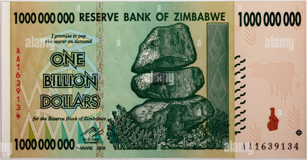
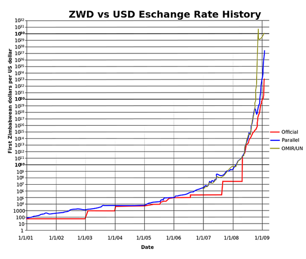
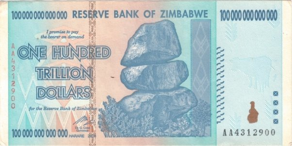

*Réponse publiée [sur Quora](https://fr.quora.com/Si-on-donne-%C3%A0-chaque-personne-1-milliard-qu-arriverait-il-au-monde/answer/Dr-Goulu)*

Le Zimbabwe a essayé.

Ce billet d'un milliard de dollars Zimbabwe valait environ 1 dollar américain le premier janvier 2008, environ 10 cents en février, plus qu' 1 cent en mars …

et autour de juin 2008, le Zimbabwe a du émettre des billets de 100'000 milliards de dollars

qui valaient 1 dollar US, 10 cents en juillet, 1 cent en août …

le 1er janvier 2009, il fallait 27 zéros, soit un milliard de milliard de milliard de dollars zimbabwéens pour acheter l'équivalent de 1 dollar américain.

Tout simplement parce que la valeur de la monnaie ne correspondait pas à une valeur "réelle".

Pour une autre réponse j'avais calculé que si on répartissait également toute la valeur réelle de la planète entre les 8 milliards d'habitants, on arriverait environ à $35'000 ( ou euro) par personne.

Donc si vous donnez à chacun un milliard en monnaie, il n'y a pas assez de choses que les gens peuvent s'acheter avec ce milliard. Il y aura 1E9/35000 = 28571 fois trop d'argent par rapport aux biens disponibles.

Alors que va-t'il se passer ? Ben les gens qui ont des choses vont les vendre 28571 fois plus cher, c'est tout.
