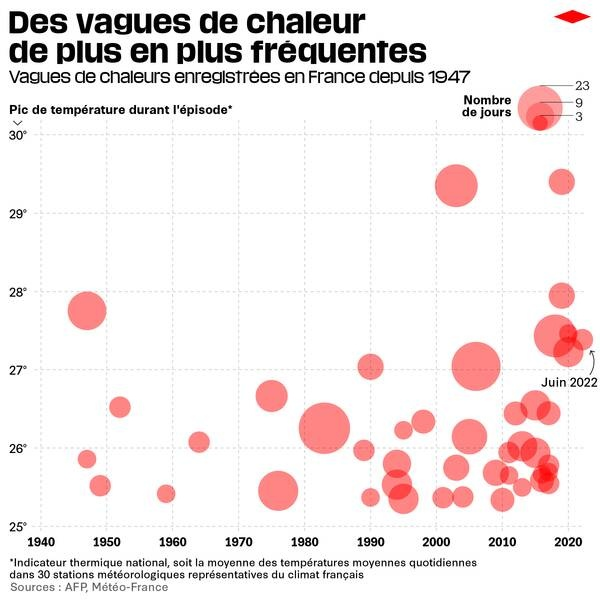

*Réponse publiée [sur Quora](https://fr.quora.com/Pourquoi-parle-t-on-de-canicule-alors-que-ce-matin-il-fait-17-sur-la-C%C3%B4te-dAzur-Habituellement-il-fait-au-moins-22-en-juillet/answer/Dr-Goulu)*

C'est dans la variabilité normale.

Maintenant regardez

[https://www.meteo-nice.org/recor...](https://www.meteo-nice.org/records/mois/juillet)

Pour les températures mini minimales, aucun record n'a été atteint après 2000. (deux jours records en 2000)

Pour les températures mini maximales tous les records datent d'après 2006 sauf 2 en 1983.

Même tendance, quoique plus bruitee, pour les températures maximales.

Un petit graphique vaut mieux qu'un long discours

Quand on ajoutera 2023 ça sera encore plus clair. Et puis il y aura 2024. Et 2025…
